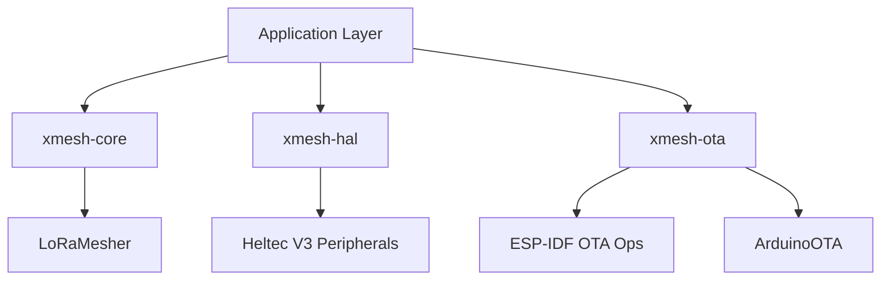

# xMESH System Architecture

This document provides a comprehensive overview of the xMESH system architecture, module dependencies, and core algorithms.

## System Overview

xMESH is built on top of the LoRaMesher library, providing an advanced routing layer optimized for production environments. It follows a modular design with a clear separation of concerns between core logic, hardware abstraction, and remote maintenance.



*ASCII Art Version:*
```text
+---------------------------------------+
|          Application Layer            |
|       (firmware/production)           |
+----------+------------+------------+--+
           |            |            |
+----------v----+  +----v-------+  +-v----------+
|  xmesh-core   |  | xmesh-hal  |  | xmesh-ota  |
| (Routing)     |  | (Hardware) |  | (Updates)  |
+----------+----+  +------------+  +------------+
           |
+----------v----+
|  LoRaMesher   |
| (LoRa Stack)  |
+---------------+
```

## Module Dependency Diagram

```text
xmesh-core
├── CostRouter (Standalone)
├── TrickleScheduler (Standalone)
├── ETXTracker (Standalone)
└── GatewayBalancer (Standalone)

xmesh-hal
├── Display (Wraps Adafruit_SSD1306)
└── Sensors (Stubs for PMS7003/GPS)

xmesh-ota
├── OTAManager (Wraps ESP-IDF + ArduinoOTA)
└── VersionControl (Semantic Versioning)
```

## Data Flows

### 1. HELLO Propagation & Scheduling
xMESH uses the **Trickle Algorithm** (RFC 6206) to adaptively schedule HELLO messages.

- **Stable Network**: Interval $I$ doubles until $I_{max}$ (600s), minimizing overhead.
- **Topology Change**: Interval $I$ resets to $I_{min}$ (60s) for rapid convergence.
- **Suppression**: If a node hears a HELLO from a neighbor before its own transmission time $t$, it suppresses its own HELLO (if counter $c \ge k$).

### 2. Multi-Metric Cost Calculation
Path selection is driven by a multi-metric cost function registered via a callback in LoRaMesher.

**Cost Formula:**
$Cost = W_1 \cdot Hops + W_2 \cdot (1 - \text{norm\_RSSI}) + W_3 \cdot (1 - \text{norm\_SNR}) + W_4 \cdot ETX + W_5 \cdot \text{GatewayBias}$

- **Hysteresis**: A 15% threshold ($0.85 \times \text{current\_cost}$) is applied to prevent route flapping between paths with similar costs.

### 3. Zero-Overhead ETX Tracking
Link quality is estimated by monitoring gaps in sequence numbers of received HELLO packets.

- **Detection**: If $Seq_{received} > Seq_{last} + 1$, the gap is recorded as packet loss.
- **Smoothing**: Instantaneous ETX ($1 / \text{delivery\_ratio}$) is smoothed using EWMA ($\alpha = 0.3$).
- **Efficiency**: No extra probe packets or ACKs required for Link Quality Estimation (LQE).

## Library Structure

### xmesh-core
The core routing stack, implementation of Protocol 3 algorithms.
- **CostRouter**: Implements the multi-metric weighted cost function.
- **TrickleScheduler**: Manages adaptive timing for control traffic.
- **ETXTracker**: Maintains neighbor link quality metrics via sequence gaps.
- **GatewayBalancer**: Tracks gateway load and applies bias to route costs.

### xmesh-hal
Hardware Abstraction Layer for the Heltec WiFi LoRa 32 V3.
- **SSD1306 OLED**: Drivers and high-level rendering for mesh status.
- **Sensors**: Interfaces for environmental monitoring (PMS7003 Air Quality, GPS).

### xmesh-ota
Remote maintenance system using ESP-IDF native partition management.
- **Dual-Slot OTA**: Safe updates with `app0` and `app1` partitions.
- **Rollback Protection**: Automatically reverts to the previous version if the new firmware fails to boot 3 times.

## Algorithm Summaries

| Algorithm | Reference | Purpose | Key Parameters |
|-----------|-----------|---------|----------------|
| **Trickle** | RFC 6206 | Adaptive Scheduling | $I_{min}=60s, I_{max}=600s, k=1$ |
| **Cost Function** | Protocol 3 | Route Selection | Weights $W_1$-$W_5$ |
| **ETX Tracking** | LQE | Link Quality | Window=10, $\alpha=0.3$ |
| **Gateway Balancing**| Load-Aware | Traffic Distribution | PPM Load Metric |

## Integration with LoRaMesher

xMESH integrates with LoRaMesher via optional callback hooks:
1. `CostCalculationCallback`: Replaces the default hop-count comparison with the multi-metric cost function.
2. `HelloReceivedCallback`: Informs the Trickle scheduler of neighbor activity for suppression and resets.

This ensures 100% compatibility with the underlying LoRaMesher stack while providing advanced routing capabilities.
